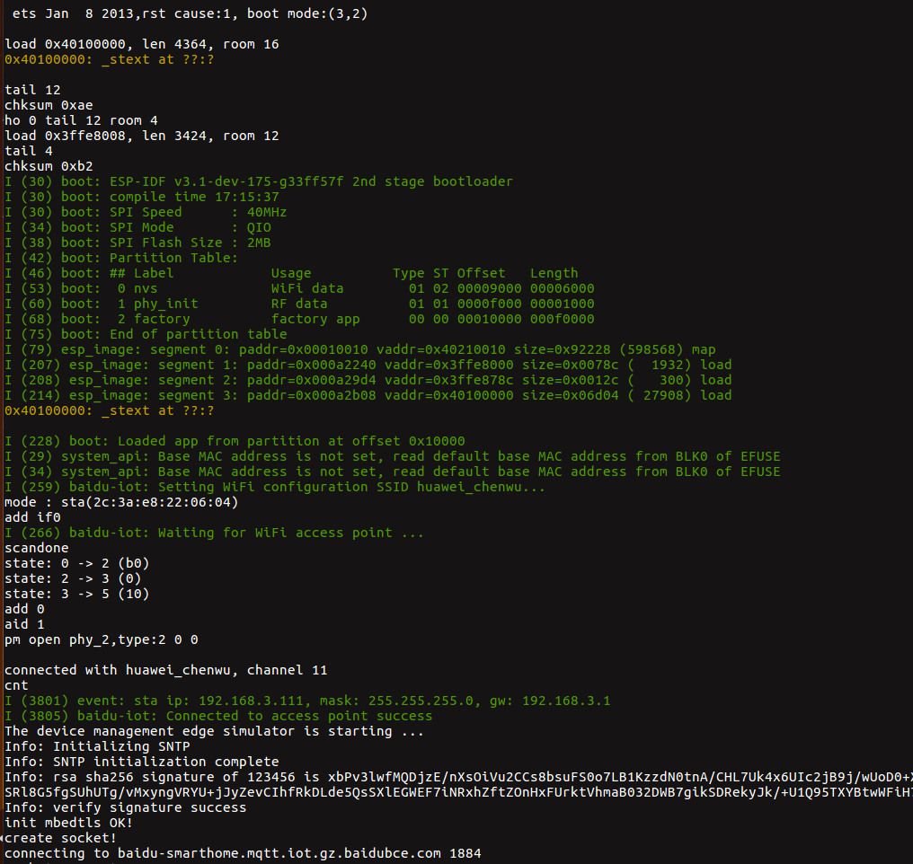

#### smarthome 用户使用指南

#### 1. 配置连接信息
根据 [设备管理平台设备端sdk使用文档](https://github.com/baidu/iot-edge-c-sdk/blob/master/iothub_client/samples/iot_smarthome_client_sample/README.md) 获取 
[iot_smarthome_client_sample.c](main/iot_smarthome_client_sample.c) 下 `DEVICE`，`USERNAME`， `SUBDEVICE`，`client_cert`， `client_key` 参数填充。

#### 2. 配置 esp 平台
- `export IDF_PATH=~/esp/ESP8266_RTOS_SDK` 或 `export IDF_PATH=~/esp/esp-idf` 导出 SDK
- `make defconfig` 配置默认系统参数
- `make menuconfig` 配置 WiFi 信息和串口信息

#### 3. 编译 && 烧写 && 运行
```
make flash monitor
```

#### 4. 查看结果
正常通讯如下:



