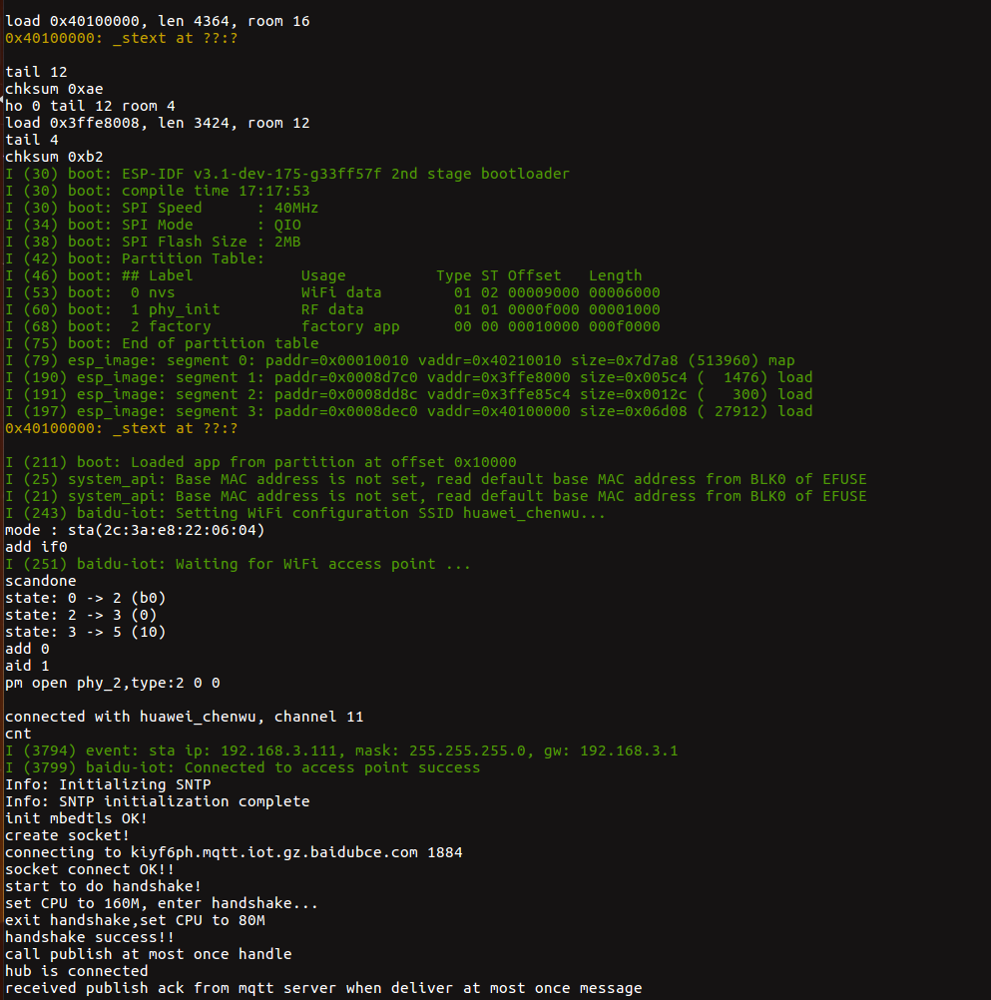

#### iothub client 用户使用指南

#### 1. 配置连接信息
根据 [百度云向导](https://cloud.baidu.com/doc/IOT/Quickstart-new.html#.5A.2B.B0.1E.23.29.42.90.D8.69.08.BF.C0.B8.75.5C) 获取 
[iothub_mqtt_client_sample.c](main/iothub_mqtt_client_sample.c) 下 `ENDPOINT`，`USERNAME`， `PASSWORD`，`client_cert`， `client_key` 参数填充。

#### 2. 配置 esp 平台
- `export IDF_PATH=~/esp/ESP8266_RTOS_SDK` 或 `export IDF_PATH=~/esp/esp-idf` 导出 SDK
- `make defconfig` 配置默认系统参数
- `make menuconfig` 配置 WiFi 信息和串口信息

#### 3. 编译 && 烧写 && 运行
```
make flash monitor
```

#### 4. 查看结果
正常通讯如下:



